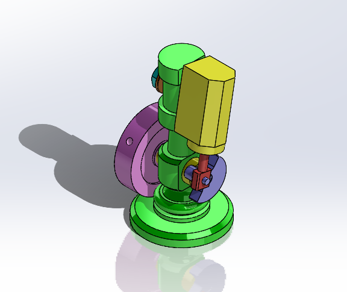
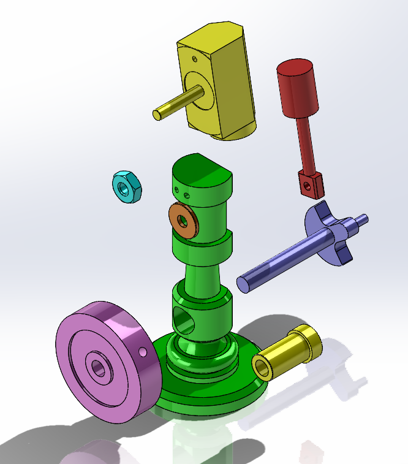
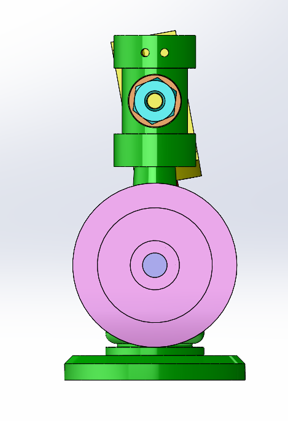
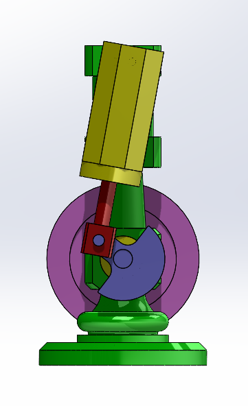

# Wobble-Steam-Engine
Wobble steam engine modeled and assembled in SOLIDWORKS for mechanical CAD practice.
# Wobble Steam Engine | SolidWorks

A 3D CAD model and assembly of a **wobble steam engine** developed in **SOLIDWORKS** as part of my mechanical CAD learning and design practice.

## Overview

This project focuses on the **3D modeling and assembly of a wobble steam engine mechanism**. Individual mechanical components were modeled in SOLIDWORKS and assembled to create the complete engine.

The project provided hands-on experience with **part modeling, assembly design, mates, exploded views, and mechanical mechanism visualization**.

---

## Project Preview

### Isometric View

### Exploded View

The exploded view shows the individual components separated from the main assembly and provides a clearer understanding of their arrangement.

### Left-Hand View

### Right-Hand View

---

## Assembly Video

A short assembly video demonstrating the modeled mechanism:

[▶️ Watch the Wobble Steam Engine Assembly](Wobble%20steam%20engine.mp4)

---

## Skills Demonstrated

* 3D Part Modeling
* Mechanical Component Modeling
* Assembly Design
* Assembly Mates
* Exploded View Creation
* Mechanical CAD Workflow
* Mechanism Visualization

---

## Software Used

* **SOLIDWORKS**

---

## Repository Contents

* `.SLDASM` – Main SolidWorks assembly
* `.SLDPRT` files – Individual component files
* `.png` files – Project preview images
* `.mp4` file – Assembly video

---

## Project Objective

The objective of this project was to develop practical skills in **mechanical CAD modeling and assembly design** by modeling individual components and integrating them into a complete wobble steam engine assembly.

---

## Author

**Barun Gautam**
Mechanical Engineering Student

**Areas of Interest:** Mechanical Design · CAD · Engineering Simulation
